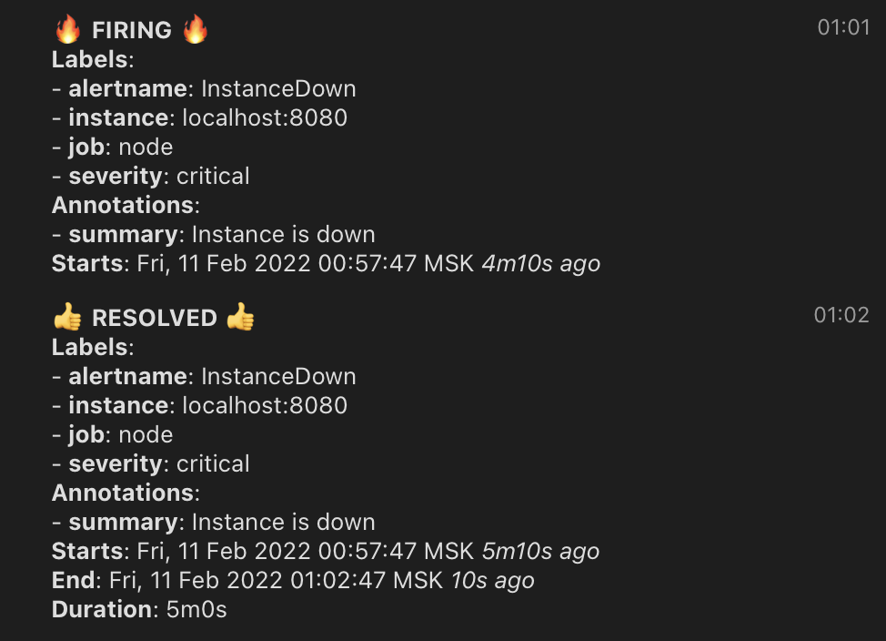

# Alertmanager-telegram
Alertmanager telegram receiver

[CLI docs](CLI.md)

## Example alerts:


## Docker images
 * amd64 `ghcr.io/a1fred/alertmanager-telegram:[latest|<version>]`
 * arm64/v8 `ghcr.io/a1fred/alertmanager-telegram:[latest|<version>]-arm64`

Get help
```shell
$ docker run --rm ghcr.io/a1fred/alertmanager-telegram --help
alertmanager-telegram@0.0.1-3a73ee0ea1c94ab1fc2ea03ab56774300d7c9d2a-2022-02-10T22:33:22Z
Usage:
  alertmanager-telegram [OPTIONS] <daemon>

Help Options:
  -h, --help  Show this help message

Available commands:
  daemon  Daemon
```

Example run
```shell
$ docker run --rm -e TELEGRAM_TOKEN="<bot token>" -e TELEGRAM_CHAT_ID="<your chat id>" ghcr.io/a1fred/alertmanager-telegram
```

## Healthcheck
You can use `/health` endpoint, always responds `200`, can be useful for health-checking.
